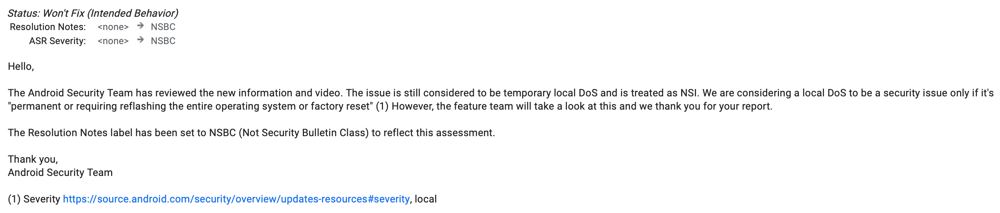
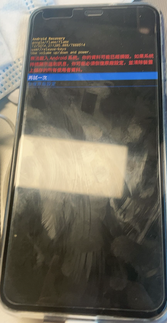

# 一个AOSP systemUI 的暂时性本地拒绝服务的bug

至于我这里为什么要说是bug，谷歌给出的解释是NSBC，所以就不算安全问题了，狗头。

可以造成的效果如下，再试一次即可恢复正常，但某些Android12的手机root过的，可能会出现root丢失的现象。 
 
具体原因看源码，顺便丢上链接,当然不知道他们的feature team什么时候修复了，狗头。
[systemui bug file](https://android.googlesource.com/platform/frameworks/base/+/refs/heads/master/packages/SystemUI/src/com/android/systemui/controls/management/ControlsRequestReceiver.kt)